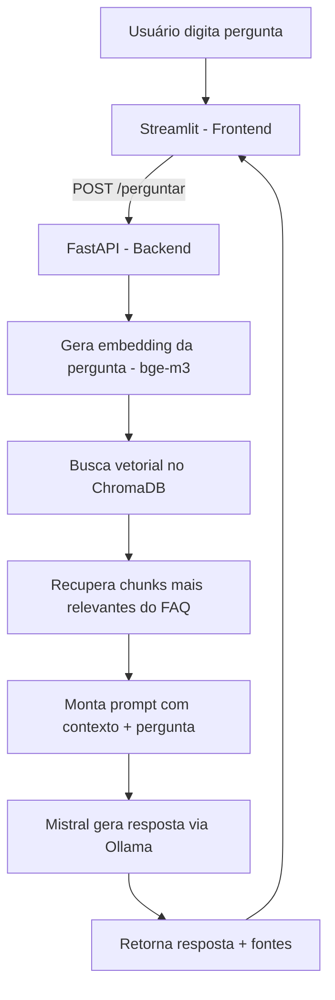

# SpotBot — Chatbot de FAQ do Spotify com RAG Local

Um chatbot de perguntas frequentes que responde dúvidas sobre os recursos do app Spotify, usando busca semântica (RAG) com modelos de IA 100% locais sem APIs pagas, sem enviar dados para a nuvem.

---

## Demonstração

> _Vídeo de demonstração do chatbot em funcionamento:_

[](https://youtu.be/JlUm-DsbaFw)


### Exemplo de resposta com fonte encontrada


### Exemplo de resposta quando a informação não está disponível no FAQ

Um dos requisitos centrais do desafio é que o chatbot **não invente respostas** quando não tem a informação. Abaixo, um exemplo real do sistema recusando educadamente responder sobre um assunto fora do escopo do FAQ coletado (preço de assinatura):


---

## Sobre o projeto

Este projeto foi desenvolvido como resposta a um desafio técnico: construir um chatbot de FAQ capaz de responder perguntas com base em uma base documental própria, utilizando exclusivamente modelos open source rodando localmente, sem depender de APIs pagas (OpenAI, Claude, Gemini, Cohere, etc.).

O assunto escolhido dentro da Central de Ajuda do Spotify foi **"Recursos no app"**, especificamente os subtópicos **"Como começar"** e **"Soluções de problemas"**, totalizando 13 artigos oficiais coletados via web scraping.

---

## Arquitetura e Pipeline



**Fluxo resumido:**
1. Usuário envia pergunta pela interface de chat (Streamlit)
2. O frontend chama a API (FastAPI) via requisição HTTP
3. A pergunta é transformada em embedding (vetor numérico) pelo modelo `bge-m3`
4. O ChromaDB busca, por similaridade, os pedaços (chunks) de texto do FAQ mais relacionados à pergunta
5. Esses chunks viram o "contexto", que é enviado junto com a pergunta para o modelo `mistral`
6. O Mistral gera uma resposta em português, baseada **apenas** no contexto fornecido
7. A resposta, junto com as fontes (URLs dos artigos originais) utilizadas, é devolvida ao usuário

---

## Tecnologias utilizadas

| Camada | Ferramenta | Função no projeto |
|---|---|---|
| Coleta de dados | **Python + Requests + BeautifulSoup** | Web scraping dos artigos de suporte do Spotify |
| LLM local | **Ollama** | Motor de execução local de modelos de IA, sem custo e sem nuvem |
| Geração de texto | **Mistral (7B)** | Modelo responsável por gerar a resposta final em linguagem natural |
| Embeddings | **bge-m3** | Modelo multilíngue responsável por transformar texto em vetores numéricos para busca semântica |
| Banco vetorial | **ChromaDB** | Armazena os embeddings dos chunks do FAQ e realiza a busca por similaridade |
| Framework de IA | **LangChain** | Orquestra a integração entre documentos, embeddings, banco vetorial e LLM |
| Backend | **FastAPI** | Expõe a lógica do RAG como uma API REST (`POST /perguntar`) |
| Frontend | **Streamlit** | Interface de chat com histórico, loading e identidade visual própria |
| Empacotamento | **Docker / Docker Compose** | Containerização do backend e frontend (ver seção de limitações) |

---

## Estrutura do projeto

```
spotfy-chatbot/
├── backend/
│   ├── app/
│   │   ├── __init__.py
│   │   ├── ingest.py          # Lógica de indexação (gera o vectorstore)
│   │   ├── rag_chain.py       # Lógica central do RAG (busca + geração de resposta)
│   │   └── main.py            # API FastAPI (endpoints)
│   ├── vectorstore/           # Banco vetorial ChromaDB (gerado pelo ingest.py)
│   └── Dockerfile
├── frontend/
│   ├── app.py                 # Interface de chat em Streamlit
│   └── Dockerfile
├── data/
│   └── faq_recursos_app.json  # FAQ coletado via scraping
├── dev/
│   └── diagnosticar_busca.py  # Script que documenta a decisão de troca do modelo de embedding
├── .streamlit/
│   └── config.toml            # Tema visual (cores do Spotify)
├── scraper.py                 # Script de coleta do FAQ
├── testar_perguntas.py        # Suíte de testes (perguntas cobrindo o FAQ)
├── testar_perguntas2.py       # Suíte de testes (cobertura adicional + anti-alucinação)
├── docker-compose.yml
├── .dockerignore
├── .gitignore
├── requirements.txt
└── README.md
```

---

## Como executar (forma validada — Python nativo)

Esta é a forma de execução **testada e validada** ao longo de todo o desenvolvimento.

### Pré-requisitos

- Python 3.11+
- [Ollama](https://ollama.com) instalado

### Passo a passo

```bash
# 1. Clonar o repositório
git clone <url-do-seu-repositorio>
cd spotfy-chatbot

# 2. Criar e ativar o ambiente virtual
python -m venv venv
venv\Scripts\Activate.ps1        # Windows (PowerShell)
# source venv/bin/activate       # Mac/Linux

# 3. Instalar as dependências
pip install -r requirements.txt

# 4. Baixar os modelos necessários no Ollama
ollama pull mistral
ollama pull bge-m3

# 5. (Opcional) Rodar o scraper para coletar/atualizar o FAQ
python scraper.py

# 6. (Opcional) Gerar o índice vetorial a partir do FAQ
python backend/app/ingest.py

# 7. Rodar o backend (FastAPI)
uvicorn backend.app.main:app --reload --reload-dir backend/app

# 8. Em outro terminal, rodar o frontend (Streamlit)
streamlit run frontend/app.py
```

Acesse `http://localhost:8501` no navegador.

> **Nota sobre performance:** a primeira pergunta de cada sessão pode demorar alguns minutos, pois os modelos de IA precisam ser carregados na memória (RAM) pela primeira vez. O backend já inclui uma rotina de "aquecimento" (`@app.on_event("startup")`) que carrega os modelos assim que o servidor sobe, reduzindo esse impacto para o usuário final.

---

## 🐳 Docker — Arquivos criados e limitação de validação local

O projeto inclui `Dockerfile` (backend e frontend) e `docker-compose.yml`, seguindo as boas práticas pedidas no desafio:

- Imagens baseadas em `python:3.11-slim` (leves)
- `.dockerignore` configurado para não copiar `venv/`, cache e arquivos de desenvolvimento
- Variáveis de ambiente (`OLLAMA_BASE_URL`, `API_URL`) configuráveis, permitindo que os containers se conectem corretamente entre si e com o Ollama rodando no host
- `host.docker.internal` configurado para permitir que o container do backend acesse o Ollama rodando fora do Docker, na máquina host

### Limitação conhecida

**Não foi possível validar a execução via `docker compose up` localmente.** A máquina utilizada no desenvolvimento (notebook com processador Intel Core i5-2450M, BIOS de 2012) não expõe, em nenhum menu da BIOS/UEFI, a opção de habilitar a virtualização de hardware (Intel VT-x) um pré-requisito do Docker Desktop no Windows. Essa é uma limitação de firmware do fabricante, não contornável via software.

Os arquivos Docker foram escritos seguindo as práticas padrão da comunidade e a documentação oficial do Docker e do FastAPI/Streamlit, e devem funcionar corretamente em:
- Qualquer máquina com virtualização habilitada
- Qualquer serviço de build em nuvem (Render, Railway, Fly.io conforme sugerido no desafio), já que esses serviços constroem a imagem em seus próprios servidores, não na máquina local do desenvolvedor

### Comando para rodar via Docker (em uma máquina compatível)

```bash
docker compose up --build
```

Acesse `http://localhost:8501`.

---

## Requisitos do desafio atendidos

| Requisito | Status |
|---|---|
| Sem uso de APIs pagas | ✅ |
| Execução local (modelos open source) | ✅ |
| Indexação semântica | ✅ |
| Busca contextual (vetorial) | ✅ |
| Integração com LLM | ✅ |
| Interface de chat (campo, histórico, loading) | ✅ |
| Resposta com fontes | ✅ |
| Evitar respostas inventadas | ✅ (validado com testes específicos) |
| Dockerfile + docker-compose | ✅ (arquivos criados; validação local limitada por hardware) |
| Instruções de execução | ✅ |

---

## Processo de desenvolvimento: desafios encontrados e correções aplicadas

Esta seção documenta, em ordem cronológica, os principais problemas reais enfrentados durante o desenvolvimento e como cada um foi diagnosticado e corrigido um retrato fiel do processo real de construção de um sistema de RAG, não apenas do resultado final.

### 1. Texto "grudado" na extração do HTML

**Problema:** o scraper extraía texto de elementos HTML aninhados sem espaçamento, gerando palavras coladas (ex: `"recursoBuscarpara"`).

**Causa:** o método `.get_text(strip=True)` do BeautifulSoup não insere separador entre textos de tags filhas.

**Correção:** adicionado `separator=" "` na extração: `.get_text(separator=" ", strip=True)`.

### 2. Chunks misturando múltiplos assuntos

**Problema:** um único chunk continha, por exemplo, trechos sobre "Baixar o app", "Criar conta" e "Solte o som" ao mesmo tempo, diluindo a precisão da busca semântica.

**Causa:** o conteúdo era unido com quebra de linha simples (`\n`), e o `RecursiveCharacterTextSplitter` prioriza cortar em quebras duplas (`\n\n`) para respeitar parágrafos.

**Correção:** alterado para `"\n\n".join(linhas)` no scraper, e reduzido o `chunk_size` de 500 para 300 caracteres, aumentando a granularidade.

### 3. Modelo de embedding com baixa performance em português

**Problema:** a pergunta "Como eu crio uma conta no Spotify?" não encontrava o chunk correto (sobre "Criar sua conta") nem entre os 10 primeiros resultados da busca.

**Diagnóstico:** um script de diagnóstico (`dev/diagnosticar_busca.py`) revelou, através da análise de distância vetorial, que o modelo `nomic-embed-text` relacionava mal sinônimos em português.

**Correção:** substituição do modelo de embedding por `bge-m3`, especializado em multilinguismo, exigindo reindexação completa do banco vetorial.

### 4. Alucinação em perguntas fora do escopo do FAQ

**Problema:** perguntas sobre assuntos não cobertos pelo FAQ coletado (ex: preço da assinatura Premium, cancelamento) geravam respostas inventadas pelo modelo (preços e URLs fictícios).

**Correção (em 3 iterações):**
- V1: prompt simples pedindo para responder "apenas com base no contexto" insuficiente.
- V2: prompt rígido em maiúsculas + filtro de distância vetorial como trava de segurança reduziu a alucinação, mas causou **falsos bloqueios** em perguntas legítimas (a distância vetorial não separava de forma confiável perguntas válidas de inválidas) e gerou comentários estranhos do modelo sobre as próprias instruções.
- V3 (final): prompt equilibrado, com tom natural e **exemplos concretos** do que recusar (preços, planos, cancelamento), sem filtro de distância. Validado com sucesso através de testes sistemáticos.

### 5. Reinicializações indevidas do servidor (reload incorreto)

**Problema:** o servidor FastAPI, configurado com `--reload`, reiniciava sozinho no meio de requisições, causando respostas que simplesmente não retornavam, de forma aparentemente aleatória.

**Causa raiz:** o comando `--reload-dir backend` monitorava toda a pasta `backend/`, incluindo `backend/vectorstore/` e o próprio ChromaDB escreve arquivos internos no disco durante operações de busca, disparando reinicializações falsas do servidor.

**Correção:** restrição do monitoramento apenas ao código-fonte: `--reload-dir backend/app`.

### 6. Erro de validação do parâmetro `keep_alive`

**Problema:** `OllamaEmbeddings(model="bge-m3", keep_alive="60m")` falhava com erro de validação Pydantic.

**Causa:** diferente de `ChatOllama`, a classe `OllamaEmbeddings` espera um valor inteiro (segundos), não uma string como `"60m"`.

**Correção:** uso de `keep_alive=3600` (segundos) para o modelo de embedding.

### 7. Carregamento lento na primeira pergunta

**Problema:** a primeira pergunta de cada sessão demorava vários minutos, por conta do carregamento inicial dos modelos de IA na memória risco de timeout e perda de conexão no frontend.

**Correção:** implementação de uma rotina de "aquecimento" (`@app.on_event("startup")`), que carrega os modelos assim que o servidor FastAPI inicia, antes de qualquer interação do usuário, e configuração de `keep_alive` para manter os modelos carregados por mais tempo entre chamadas.

---

## Limitações conhecidas

- **Hardware limitado:** o projeto foi desenvolvido e testado em uma máquina sem GPU dedicada e com 8GB de RAM. O tempo de resposta pode variar significativamente (de segundos a alguns minutos) dependendo da disponibilidade de recursos do sistema no momento da consulta.
- **Docker não validado localmente:** conforme detalhado na seção correspondente, por limitação de BIOS do hardware de desenvolvimento.
- **Cobertura do FAQ:** o chatbot responde apenas sobre os assuntos "Como começar" e "Soluções de problemas" da categoria "Recursos no app" do Spotify. Perguntas sobre outros temas (pagamentos, planos, conta) são corretamente recusadas por estarem fora do escopo da base de conhecimento.

---

## Possíveis melhorias futuras

- Expandir o FAQ para cobrir mais categorias de suporte do Spotify
- Adicionar testes automatizados (pytest) para a suíte de validação
- Integrar observabilidade (ex: MLflow Tracing) para monitorar qualidade das respostas em produção
- Validar a execução via Docker em um ambiente com virtualização habilitada ou diretamente em um serviço de deploy em nuvem

---

## Autora

Projeto desenvolvido como parte de um desafio técnico de construção de chatbot com RAG, Python, IA generativa local e boas práticas de desenvolvimento full stack.
